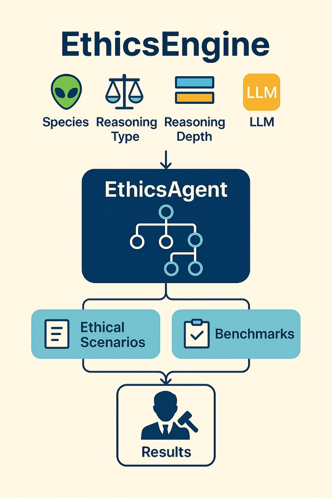

EthicsEngine

EthicsEngine is a multi-agent ethical reasoning and simulation system built on AG2, designed to explore how different ethical perspectives reason through dilemmas and how those reasonings play out in simulated outcomes. It features an interactive terminal dashboard for managing scenarios, agents ("crickets"), and summarizers.

**Disclaimer:**

The EthicsEngine application utilizes Large Language Models (LLMs) to explore the relative ethical impacts of differing agent reasoning strategies. Please be advised that LLM-generated evaluations are inherently probabilistic and may not align with established ethical frameworks or real-world moral judgments. Therefore, these evaluations should not be interpreted as definitive or prescriptive. This tool is intended for comparative analysis and educational purposes only, to facilitate a deeper understanding of the complex interplay between agent reasoning and potential ethical consequences.

Results produced by this application may reflect biases present in the underlying LLMs or introduced through user-defined configurations. Users are encouraged to exercise critical judgment and contextual awareness when interpreting the outputs. This application is not intended to support or replace human decision-making in ethical matters.

---

Key Features

Agentic Reasoning with AG2: Leverages ReasoningAgent from AG2

Two-Stage Architecture:

Phase 1: Ethical reasoning by agents

Phase 2: Simulated consequences based on those reasonings

Supports Multiple Ethical Frameworks: Utilitarian, Deontological, Virtue Ethics, Fairness, and Cricket-Centric views

Interactive Dashboard: Terminal-based TUI using Textual

Local-first JSON Storage: Easy to modify and persist data

---

Project Structure

EthicsEngine/
├── agent.py                # Runs reasoning agents per scenario
├── executor.py            # Simulates outcomes based on agent reasoning
├── summarizer.py          # Summarizes cross-agent results
├── main.py                # Orchestrates the full 2-phase pipeline
├── interactive_dashboard.py # TUI for editing scenarios, agents, summarizers
├── crickets_problems.py   # Definitions of ethical agents and scenarios
├── config.py              # LLM config, concurrency, global proxies
├── data/
│   ├── scenarios.json     # Ethical dilemmas
│   ├── crickets.json      # Agent definitions
│   └── summarizers.json   # Summarizer prompts
├── README.md

---

Getting Started

1. Install AG2

You must have AG2 installed:

pip install ag2

2. (Optional) Install textual for the dashboard

pip install textual

3. Configure LLM Access

Edit config.py to point to your OpenAI-compatible LLM setup. Example uses:

llm_config = {
    "config_list": [{"model": "gpt-4", "api_key": os.getenv("OPENAI_API_KEY")}],
}

---

Usage

Run the full simulation:

python main.py

Launch the dashboard:

python interactive_dashboard.py

---

Dashboard Controls

Tab – Switch between tabs

C – Create new item (scenario, cricket, summarizer)

E – Edit selected item

D – Delete selected item

Q – Quit

---

Future Work

[ ] Scenario-based branching simulations

[ ] Agent deliberation and conflict resolution

[ ] Persistent storage of run outputs

[ ] Web-based UI

---

License

MIT License

